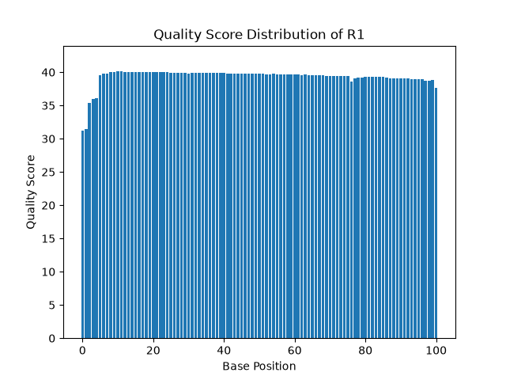
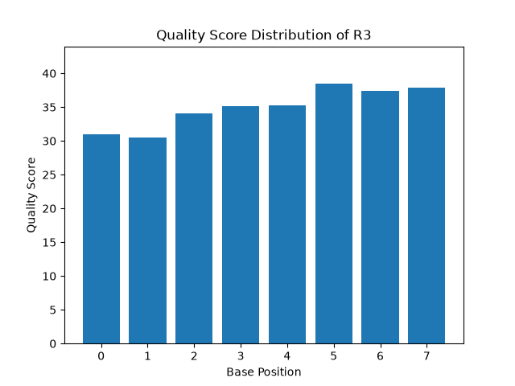
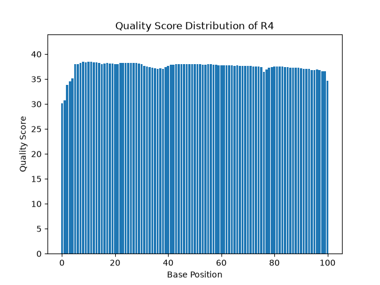

# Assignment the First

## Part 1
1. Be sure to upload your Python script. Provide a link to it here:

[Python script for Part 1](./Part1.py)

[Psuedocode for Part 2](./Part2.md)

| File name | label | Read length | Phred encoding |
|---|---|---|---|
| 1294_S1_L008_R1_001.fastq.gz | read1 | 101 | +33 |
| 1294_S1_L008_R2_001.fastq.gz | index1 | 8 | +33 |
| 1294_S1_L008_R3_001.fastq.gz | index2 | 8 | +33 |
| 1294_S1_L008_R4_001.fastq.gz | read2 | 101 | +33 |

2. Per-base NT distribution (qscore)
    1. Use markdown to insert your 4 histograms here.
    
    
    
    
    2. In all the quality score distributions, no base drops below an average of 30. I think this is a good cutoff
    3. Using: `zcat /projects/bgmp/shared/2017_sequencing/1294_S1_L008_R2_001.fastq.gz | grep -A 1 "^@" | grep -v "^@" | grep N | wc -l`, Index 1 had 3,976,613 reads containing Ns. Index 2 had 3,328,051 reads containing Ns

    
## Part 2
1. Define the problem
2. Describe output
3. Upload your [4 input FASTQ files](../TEST-input_FASTQ) and your [>=6 expected output FASTQ files](../TEST-output_FASTQ).
4. Pseudocode
5. High level functions. For each function, be sure to include:
    1. Description/doc string
    2. Function headers (name and parameters)
    3. Test examples for individual functions
    4. Return statement
